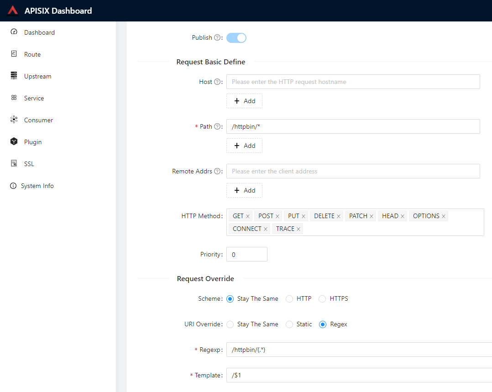
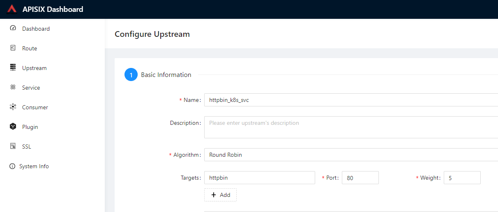
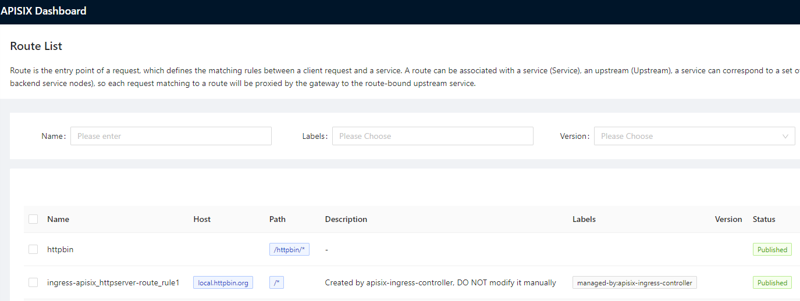
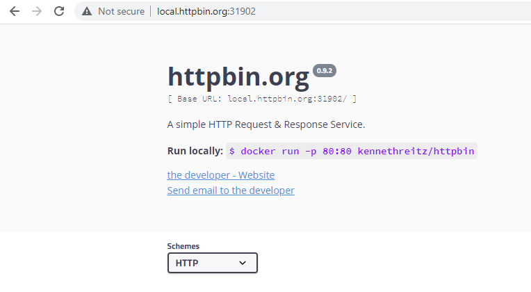

<!--
#

# Licensed to the Apache Software Foundation (ASF) under one or more
# contributor license agreements.  See the NOTICE file distributed with
# this work for additional information regarding copyright ownership.
# The ASF licenses this file to You under the Apache License, Version 2.0
# (the "License"); you may not use this file except in compliance with
# the License.  You may obtain a copy of the License at
#
#     http://www.apache.org/licenses/LICENSE-2.0
#
# Unless required by applicable law or agreed to in writing, software
# distributed under the License is distributed on an "AS IS" BASIS,
# WITHOUT WARRANTIES OR CONDITIONS OF ANY KIND, either express or implied.
# See the License for the specific language governing permissions and
# limitations under the License.
#
-->

# Prerequisites
```markdown
# get apisix-helm-chart (master)
git clone https://github.com/apache/apisix-helm-chart.git

# working directory
cd /path/to/apisix-helm-chart/

# create new k8s namespace
kubectl create ns ingress-apisix

# install helm3

# prepare available node ports
31900 for apisix-dashboard
31901 for apisix-admin
31902 for apisix-gateway
```

# Installation

## Install apisix-etcd separetely

```shell
kubectl run apisix-etcd -n ingress-apisix --image bitnami/etcd:3.4.15 --port 2379 \
   --env ALLOW_NONE_AUTHENTICATION=yes \
   --env ETCD_ADVERTISE_CLIENT_URLS=http://apisix-etcd:2379 

kubectl expose pod apisix-etcd --name apisix-etcd -n ingress-apisix --port 2379
```

## Install apisix with existing etcd

Customize parameters refer to https://github.com/apache/apisix-helm-chart/blob/master/charts/apisix/README.md#parameters

```shell
helm install -n ingress-apisix apisix charts/apisix \
    --set etcd.enabled=false \
    --set etcd.host={http://apisix-etcd:2379} \
    --set admin.allow.ipList="{0.0.0.0/0}" \
    --set admin.type=NodePort \
    --set admin.nodePort=31901 \
    --set gateway.http.nodePort=31902

# helm uninstall -n ingress-apisix apisix
# curl http://${YOUR_NODE_IP}:31901/
```

## Install apisix-ingress-controller

```shell
helm install -n ingress-apisix apisix-ingress-controller charts/apisix-ingress-controller 

# helm uninstall -n ingress-apisix apisix-ingress-controller
```

## Install apisix-dashboard
```shell
helm install -n ingress-apisix apisix-dashboard charts/apisix-dashboard  \
  --set service.type=NodePort \
  --set service.nodePort=31900

# helm uninstall -n ingress-apisix apisix-dashboard
# curl http://${YOUR_NODE_IP}:31900/
```

# Validation

## Start httpbin
```shell
# httpbin pod
kubectl run httpbin -n ingress-apisix --image kennethreitz/httpbin --port 80

# httpbin svc
kubectl expose -n ingress-apisix pod httpbin --port 80

# kubectl delete svc httpbin
```

## Add route by bashboard

### Add route to httpbin



### Add upstream of httpbin service




test by curl
```shell
curl http://${YOUR_NODE_IP}:31902/httpbin/get
```
 the response should be like this
```json
{
  "args": {},
  "headers": {
    "Accept": "*/*",
    "Host": "10.x.xx.xx:31902",
    "User-Agent": "curl/7.67.0",
    "X-Forwarded-Host": "10.x.x.x"
  },
  "origin": "10.x.x.x",
  "url": "http://10.x.x.x/get"
}
```


## Add route by CRD ApisixRoute

Refer to https://github.com/apache/apisix-ingress-controller/blob/master/docs/en/latest/practices/proxy-the-httpbin-service.md

### Create the ApisixRoute 
```yaml
#httpbin-route.yaml
apiVersion: apisix.apache.org/v2alpha1
kind: ApisixRoute
metadata:
  name: httpserver-route
spec:
  http:
  - name: rule1
    match:
      hosts:
      - local.httpbin.org
      paths:
      - /*
    backend:
        serviceName: httpbin
        servicePort: 80
```

After that you can get a new record in Route List



### Add hosts mapping 

```shell
# C:\Windows\System32\drivers\etc\hosts
# /etc/hosts

${YOUR_NODE_IP}   local.httpbin.org
```

Then you can access httpbin home by host

